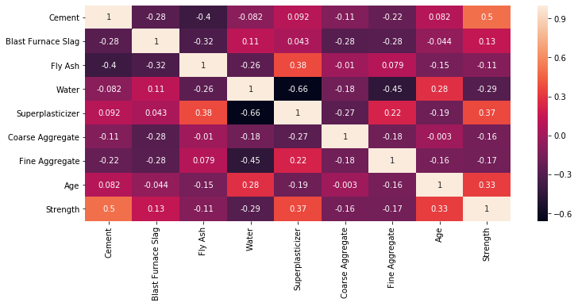

<h2><center> Building a Concrete Compressive Strength Model using Deep Learning Keras Library </center></h2>


<strong>The dataset is about the compressive strength of different samples of concrete based on the volumes of the different ingredients that were used to make them.</strong>
    
<strong>Ingredients include:</strong>
<ol type="1">
  <li>Cement</li>
  <li>Blast Furnace Slag</li>
  <li>Fly Ash</li>
  <li>Water</li>
  <li>Superplasticizer</li>
  <li>Coarse Aggregate</li>
  <li>Fine Aggregate</li>
  <li>Age</li>
</ol>

<h3><font color="red"> The objective of this project is to build a regression model using Keras library to predict the compressive strength of a concrete based on its ingredients.</font></h3>

### 1. OBTAIN - Obtain Data from its Source.

First lets download the data and stored in pandas dataframe


```python
import pandas as pd
import numpy as np

import matplotlib.pyplot as plt
import seaborn as sns

import time
start = time.time()
```


```python
url = 'https://s3-api.us-geo.objectstorage.softlayer.net/cf-courses-data/CognitiveClass/DL0101EN/labs/data/concrete_data.csv'
```


```python
df = pd.read_csv(url)
```


```python
df.head()
```


<div>
<style scoped>
    .dataframe tbody tr th:only-of-type {
        vertical-align: middle;
    }

    .dataframe tbody tr th {
        vertical-align: top;
    }

    .dataframe thead th {
        text-align: right;
    }
</style>
<table border="1" class="dataframe">
  <thead>
    <tr style="text-align: right;">
      <th></th>
      <th>Cement</th>
      <th>Blast Furnace Slag</th>
      <th>Fly Ash</th>
      <th>Water</th>
      <th>Superplasticizer</th>
      <th>Coarse Aggregate</th>
      <th>Fine Aggregate</th>
      <th>Age</th>
      <th>Strength</th>
    </tr>
  </thead>
  <tbody>
    <tr>
      <th>0</th>
      <td>540.0</td>
      <td>0.0</td>
      <td>0.0</td>
      <td>162.0</td>
      <td>2.5</td>
      <td>1040.0</td>
      <td>676.0</td>
      <td>28</td>
      <td>79.99</td>
    </tr>
    <tr>
      <th>1</th>
      <td>540.0</td>
      <td>0.0</td>
      <td>0.0</td>
      <td>162.0</td>
      <td>2.5</td>
      <td>1055.0</td>
      <td>676.0</td>
      <td>28</td>
      <td>61.89</td>
    </tr>
    <tr>
      <th>2</th>
      <td>332.5</td>
      <td>142.5</td>
      <td>0.0</td>
      <td>228.0</td>
      <td>0.0</td>
      <td>932.0</td>
      <td>594.0</td>
      <td>270</td>
      <td>40.27</td>
    </tr>
    <tr>
      <th>3</th>
      <td>332.5</td>
      <td>142.5</td>
      <td>0.0</td>
      <td>228.0</td>
      <td>0.0</td>
      <td>932.0</td>
      <td>594.0</td>
      <td>365</td>
      <td>41.05</td>
    </tr>
    <tr>
      <th>4</th>
      <td>198.6</td>
      <td>132.4</td>
      <td>0.0</td>
      <td>192.0</td>
      <td>0.0</td>
      <td>978.4</td>
      <td>825.5</td>
      <td>360</td>
      <td>44.30</td>
    </tr>
  </tbody>
</table>
</div>


Let's check the shape of the dataframe

### 2. SCRUB - Clean / Preprocess Data to Format that Machine Understand.


```python
df.isnull().sum()
```


    Cement                0
    Blast Furnace Slag    0
    Fly Ash               0
    Water                 0
    Superplasticizer      0
    Coarse Aggregate      0
    Fine Aggregate        0
    Age                   0
    Strength              0
    dtype: int64


The data looks very clean; no missing data and all data is in numerical form. 

Nothing much here, lets move to our next step!

### 3. EXPLORE - Find Significant Patterns and Trends using Statistical Method.


```python
df.shape
```


    (1030, 9)


```python
df.describe()
```


<div>
<style scoped>
    .dataframe tbody tr th:only-of-type {
        vertical-align: middle;
    }

    .dataframe tbody tr th {
        vertical-align: top;
    }

    .dataframe thead th {
        text-align: right;
    }
</style>
<table border="1" class="dataframe">
  <thead>
    <tr style="text-align: right;">
      <th></th>
      <th>Cement</th>
      <th>Blast Furnace Slag</th>
      <th>Fly Ash</th>
      <th>Water</th>
      <th>Superplasticizer</th>
      <th>Coarse Aggregate</th>
      <th>Fine Aggregate</th>
      <th>Age</th>
      <th>Strength</th>
    </tr>
  </thead>
  <tbody>
    <tr>
      <th>count</th>
      <td>1030.000000</td>
      <td>1030.000000</td>
      <td>1030.000000</td>
      <td>1030.000000</td>
      <td>1030.000000</td>
      <td>1030.000000</td>
      <td>1030.000000</td>
      <td>1030.000000</td>
      <td>1030.000000</td>
    </tr>
    <tr>
      <th>mean</th>
      <td>281.167864</td>
      <td>73.895825</td>
      <td>54.188350</td>
      <td>181.567282</td>
      <td>6.204660</td>
      <td>972.918932</td>
      <td>773.580485</td>
      <td>45.662136</td>
      <td>35.817961</td>
    </tr>
    <tr>
      <th>std</th>
      <td>104.506364</td>
      <td>86.279342</td>
      <td>63.997004</td>
      <td>21.354219</td>
      <td>5.973841</td>
      <td>77.753954</td>
      <td>80.175980</td>
      <td>63.169912</td>
      <td>16.705742</td>
    </tr>
    <tr>
      <th>min</th>
      <td>102.000000</td>
      <td>0.000000</td>
      <td>0.000000</td>
      <td>121.800000</td>
      <td>0.000000</td>
      <td>801.000000</td>
      <td>594.000000</td>
      <td>1.000000</td>
      <td>2.330000</td>
    </tr>
    <tr>
      <th>25%</th>
      <td>192.375000</td>
      <td>0.000000</td>
      <td>0.000000</td>
      <td>164.900000</td>
      <td>0.000000</td>
      <td>932.000000</td>
      <td>730.950000</td>
      <td>7.000000</td>
      <td>23.710000</td>
    </tr>
    <tr>
      <th>50%</th>
      <td>272.900000</td>
      <td>22.000000</td>
      <td>0.000000</td>
      <td>185.000000</td>
      <td>6.400000</td>
      <td>968.000000</td>
      <td>779.500000</td>
      <td>28.000000</td>
      <td>34.445000</td>
    </tr>
    <tr>
      <th>75%</th>
      <td>350.000000</td>
      <td>142.950000</td>
      <td>118.300000</td>
      <td>192.000000</td>
      <td>10.200000</td>
      <td>1029.400000</td>
      <td>824.000000</td>
      <td>56.000000</td>
      <td>46.135000</td>
    </tr>
    <tr>
      <th>max</th>
      <td>540.000000</td>
      <td>359.400000</td>
      <td>200.100000</td>
      <td>247.000000</td>
      <td>32.200000</td>
      <td>1145.000000</td>
      <td>992.600000</td>
      <td>365.000000</td>
      <td>82.600000</td>
    </tr>
  </tbody>
</table>
</div>


```python
plt.figure(figsize=(12, 5))
correlation_matrix = df.corr()
sns.heatmap(correlation_matrix, annot=True)
plt.show()
```





As our objective is mainly to build the model, we will just touch a few in this EDA (exploratory data analysis) section.

### 4. MODEL - Construct Model to Predict and Forecast.

The part where the magic happens

#### Split Data to Predictors and Target


```python
X = df.iloc[:,:-1]
X.head()
```


<div>
<style scoped>
    .dataframe tbody tr th:only-of-type {
        vertical-align: middle;
    }

    .dataframe tbody tr th {
        vertical-align: top;
    }

    .dataframe thead th {
        text-align: right;
    }
</style>
<table border="1" class="dataframe">
  <thead>
    <tr style="text-align: right;">
      <th></th>
      <th>Cement</th>
      <th>Blast Furnace Slag</th>
      <th>Fly Ash</th>
      <th>Water</th>
      <th>Superplasticizer</th>
      <th>Coarse Aggregate</th>
      <th>Fine Aggregate</th>
      <th>Age</th>
    </tr>
  </thead>
  <tbody>
    <tr>
      <th>0</th>
      <td>540.0</td>
      <td>0.0</td>
      <td>0.0</td>
      <td>162.0</td>
      <td>2.5</td>
      <td>1040.0</td>
      <td>676.0</td>
      <td>28</td>
    </tr>
    <tr>
      <th>1</th>
      <td>540.0</td>
      <td>0.0</td>
      <td>0.0</td>
      <td>162.0</td>
      <td>2.5</td>
      <td>1055.0</td>
      <td>676.0</td>
      <td>28</td>
    </tr>
    <tr>
      <th>2</th>
      <td>332.5</td>
      <td>142.5</td>
      <td>0.0</td>
      <td>228.0</td>
      <td>0.0</td>
      <td>932.0</td>
      <td>594.0</td>
      <td>270</td>
    </tr>
    <tr>
      <th>3</th>
      <td>332.5</td>
      <td>142.5</td>
      <td>0.0</td>
      <td>228.0</td>
      <td>0.0</td>
      <td>932.0</td>
      <td>594.0</td>
      <td>365</td>
    </tr>
    <tr>
      <th>4</th>
      <td>198.6</td>
      <td>132.4</td>
      <td>0.0</td>
      <td>192.0</td>
      <td>0.0</td>
      <td>978.4</td>
      <td>825.5</td>
      <td>360</td>
    </tr>
  </tbody>
</table>
</div>


```python
y = df.iloc[:,-1]
y.head()
```


    0    79.99
    1    61.89
    2    40.27
    3    41.05
    4    44.30
    Name: Strength, dtype: float64


Save number of feature columns, <strong><i>n_cols</i></strong> to use later in model development.


```python
n_cols = X.shape[1]
n_cols
```


    8


#### Importing Libraries


```python
from sklearn.model_selection import train_test_split
from sklearn.metrics import mean_squared_error
from sklearn.metrics import r2_score

import keras

from keras.models import Sequential
from keras.layers import Dense
```

    Using TensorFlow backend.


### Building the Model

<strong><font color="red">A. BASELINE MODEL</font></strong>

<strong>Network Properties:</strong>
<ul>
  <li>Hidden Layer: 1</li>
  <li>Nodes: 10</li>
  <li>Activation Function: ReLU</li>
  <li>Optimizer: Adam</li>
  <li>Loss Function: Mean Squared Error</li>
  <li>Epochs: 50</li>
</ul>


```python
mse_A = []
r2_A = []

for i in range(50):
    
    #Split Data to Train and Test Set
    X_train, X_test, y_train, y_test = train_test_split(X, y, test_size = 0.3)

    #Create model
    model = Sequential()
    model.add(Dense(10, activation='relu', input_shape=(n_cols,)))
    model.add(Dense(1))

    #Compile model
    model.compile(optimizer='adam', loss='mean_squared_error')

    #fit the model
    model.fit(X_train, y_train, epochs=50, verbose=0)

    #predict output on test set
    y_pred = model.predict(X_test)
    
    mse_A.append(mean_squared_error(y_test, y_pred))
    r2_A.append(r2_score(y_test, y_pred))
```


```python
print('mse_Mean: {:.2f}'.format(np.mean(mse_A)))
print('mse_StdDev: {:.2f}'.format(np.std(mse_A)))
```

    mse_Mean: 305.03
    mse_StdDev: 281.36


```python
print('R^2_Mean: {:.2f}'.format(np.mean(r2_A)))
print('R^2_StdDev: {:.2f}'.format(np.std(r2_A)))
```

    R^2_Mean: -0.07
    R^2_StdDev: 0.99


<strong><font color="red">B. MODEL WITH NORMALIZED DATA</font></strong>

<strong>Network Properties:</strong>
<ul>
  <li>Hidden Layer: 1</li>
  <li>Nodes: 10</li>
  <li>Activation Function: ReLU</li>
  <li>Optimizer: Adam</li>
  <li>Loss Function: Mean Squared Error</li>
  <li>Epochs: 50</li>
</ul>

Model is retrain with normalized data.


```python
X_norm = (X - X.mean()) / X.std()
X_norm.head()
```


<div>
<style scoped>
    .dataframe tbody tr th:only-of-type {
        vertical-align: middle;
    }

    .dataframe tbody tr th {
        vertical-align: top;
    }

    .dataframe thead th {
        text-align: right;
    }
</style>
<table border="1" class="dataframe">
  <thead>
    <tr style="text-align: right;">
      <th></th>
      <th>Cement</th>
      <th>Blast Furnace Slag</th>
      <th>Fly Ash</th>
      <th>Water</th>
      <th>Superplasticizer</th>
      <th>Coarse Aggregate</th>
      <th>Fine Aggregate</th>
      <th>Age</th>
    </tr>
  </thead>
  <tbody>
    <tr>
      <th>0</th>
      <td>2.476712</td>
      <td>-0.856472</td>
      <td>-0.846733</td>
      <td>-0.916319</td>
      <td>-0.620147</td>
      <td>0.862735</td>
      <td>-1.217079</td>
      <td>-0.279597</td>
    </tr>
    <tr>
      <th>1</th>
      <td>2.476712</td>
      <td>-0.856472</td>
      <td>-0.846733</td>
      <td>-0.916319</td>
      <td>-0.620147</td>
      <td>1.055651</td>
      <td>-1.217079</td>
      <td>-0.279597</td>
    </tr>
    <tr>
      <th>2</th>
      <td>0.491187</td>
      <td>0.795140</td>
      <td>-0.846733</td>
      <td>2.174405</td>
      <td>-1.038638</td>
      <td>-0.526262</td>
      <td>-2.239829</td>
      <td>3.551340</td>
    </tr>
    <tr>
      <th>3</th>
      <td>0.491187</td>
      <td>0.795140</td>
      <td>-0.846733</td>
      <td>2.174405</td>
      <td>-1.038638</td>
      <td>-0.526262</td>
      <td>-2.239829</td>
      <td>5.055221</td>
    </tr>
    <tr>
      <th>4</th>
      <td>-0.790075</td>
      <td>0.678079</td>
      <td>-0.846733</td>
      <td>0.488555</td>
      <td>-1.038638</td>
      <td>0.070492</td>
      <td>0.647569</td>
      <td>4.976069</td>
    </tr>
  </tbody>
</table>
</div>


```python
mse_B = []
r2_B = []

for i in range(50):
    
    #Split Data to Train and Test Set
    X_train, X_test, y_train, y_test = train_test_split(X_norm, y, test_size = 0.3)

    #Create model
    model = Sequential()
    model.add(Dense(10, activation='relu', input_shape=(n_cols,)))
    model.add(Dense(1))

    #Compile model
    model.compile(optimizer='adam', loss='mean_squared_error')

    #fit the model
    model.fit(X_train, y_train, epochs=50, verbose=0)

    #predict output on test set
    y_pred = model.predict(X_test)
    
    mse_B.append(mean_squared_error(y_test, y_pred))
    r2_B.append(r2_score(y_test, y_pred))
```


```python
print('mse_Mean: {:.2f}'.format(np.mean(mse_B)))
print('mse_StdDev: {:.2f}'.format(np.std(mse_B)))
```

    mse_Mean: 388.72
    mse_StdDev: 107.32


```python
print('R^2_Mean: {:.2f}'.format(np.mean(r2_B)))
print('R^2_StdDev: {:.2f}'.format(np.std(r2_B)))
```

    R^2_Mean: -0.40
    R^2_StdDev: 0.36


<strong><font color="red">C. MODEL WITH 100 EPOCHS</font></strong>

<strong>Network Properties:</strong>
<ul>
  <li>Hidden Layer: 1</li>
  <li>Nodes: 10</li>
  <li>Activation Function: ReLU</li>
  <li>Optimizer: Adam</li>
  <li>Loss Function: Mean Squared Error</li>
  <li>Epochs: 100</li>
</ul>

Model is retrained with 100 epochs.


```python
mse_C = []
r2_C = []

for i in range(50):
    
    #Split Data to Train and Test Set
    X_train, X_test, y_train, y_test = train_test_split(X_norm, y, test_size = 0.3)

    #Create model
    model = Sequential()
    model.add(Dense(10, activation='relu', input_shape=(n_cols,)))
    model.add(Dense(1))

    #Compile model
    model.compile(optimizer='adam', loss='mean_squared_error')

    #fit the model
    model.fit(X_train, y_train, epochs=100, verbose=0)

    #predict output on test set
    y_pred = model.predict(X_test)
    
    mse_C.append(mean_squared_error(y_test, y_pred))
    r2_C.append(r2_score(y_test, y_pred))
```


```python
print('mse_Mean: {:.2f}'.format(np.mean(mse_C)))
print('mse_StdDev: {:.2f}'.format(np.std(mse_C)))
```

    mse_Mean: 165.84
    mse_StdDev: 16.69


```python
print('R^2_Mean: {:.2f}'.format(np.mean(r2_C)))
print('R^2_StdDev: {:.2f}'.format(np.std(r2_C)))
```

    R^2_Mean: 0.40
    R^2_StdDev: 0.07


<strong><font color="red">D. MODEL WITH 3 HIDDEN LAYERS</font></strong>

<strong>Network Properties:</strong>
<ul>
  <li>Hidden Layers: 3</li>
  <li>Nodes: 10</li>
  <li>Activation Function: ReLU</li>
  <li>Optimizer: Adam</li>
  <li>Loss Function: Mean Squared Error</li>
  <li>Epochs: 100</li>
</ul>

Model is retrained with 3 hidden layers.


```python
mse_D = []
r2_D = []

for i in range(50):
    
    #Split Data to Train and Test Set
    X_train, X_test, y_train, y_test = train_test_split(X_norm, y, test_size = 0.3)

    #Create model
    model = Sequential()
    model.add(Dense(10, activation='relu', input_shape=(n_cols,)))
    model.add(Dense(10, activation='relu'))
    model.add(Dense(10, activation='relu'))
    model.add(Dense(1))

    #Compile model
    model.compile(optimizer='adam', loss='mean_squared_error')

    #fit the model
    model.fit(X_train, y_train, epochs=100, verbose=0)

    #predict output on test set
    y_pred = model.predict(X_test)
    
    mse_D.append(mean_squared_error(y_test, y_pred))
    r2_D.append(r2_score(y_test, y_pred))
```


```python
print('mse_Mean: {:.2f}'.format(np.mean(mse_D)))
print('mse_StdDev: {:.2f}'.format(np.std(mse_D)))
```

    mse_Mean: 88.24
    mse_StdDev: 25.20


```python
print('R^2_Mean: {:.2f}'.format(np.mean(r2_D)))
print('R^2_StdDev: {:.2f}'.format(np.std(r2_D)))
```

    R^2_Mean: 0.69
    R^2_StdDev: 0.09


### 5. iNTERPRET - Analyze and Interpret Model

#### Comparing all evaluation metrics


```python
from IPython.display import HTML, display
import tabulate

tabletest = [['STEPS','MSE: Mean','MSE: StdDev','R^2: Mean','R^2: StdDev'],
         ['A', round(np.mean(mse_A),2), round(np.std(mse_A),2), round(np.mean(r2_A),2), round(np.std(r2_A),2)],
         ['B', round(np.mean(mse_B),2), round(np.std(mse_B),2), round(np.mean(r2_B),2), round(np.std(r2_B),2)],
         ['C', round(np.mean(mse_C),2), round(np.std(mse_C),2), round(np.mean(r2_D),2), round(np.std(r2_C),2)],
         ['D', round(np.mean(mse_D),2), round(np.std(mse_D),2), round(np.mean(r2_D),2), round(np.std(r2_D),2)]]

display(HTML(tabulate.tabulate(tabletest, tablefmt='html')))
```


<table>
<tbody>
<tr><td>STEPS</td><td>MSE: Mean</td><td>MSE: StdDev</td><td>R^2: Mean</td><td>R^2: StdDev</td></tr>
<tr><td>A    </td><td>305.03   </td><td>281.36     </td><td>-0.07    </td><td>0.99       </td></tr>
<tr><td>B    </td><td>388.72   </td><td>107.32     </td><td>-0.4     </td><td>0.36       </td></tr>
<tr><td>C    </td><td>165.84   </td><td>16.69      </td><td>0.69     </td><td>0.07       </td></tr>
<tr><td>D    </td><td>88.24    </td><td>25.2       </td><td>0.69     </td><td>0.09       </td></tr>
</tbody>
</table>


```python
end = time.time()
print('Time taken to complete iteration: {:.2f} minutes'.format((end-start)/60))
```

    Time taken to complete iteration: 29.72 minutes


<strong>From the results above, we can clearly see that by applying:</strong>
<ul>
  <li>Data Normalization,</li>
  <li>Increasing Epochs,</li>
  <li>and Increasing Hidden Layers</li>
</ul>

<strong>the mean of MSE has gone down, while the mean of R^2 has gone up indicating that the model accuracy is getting better.</strong>
